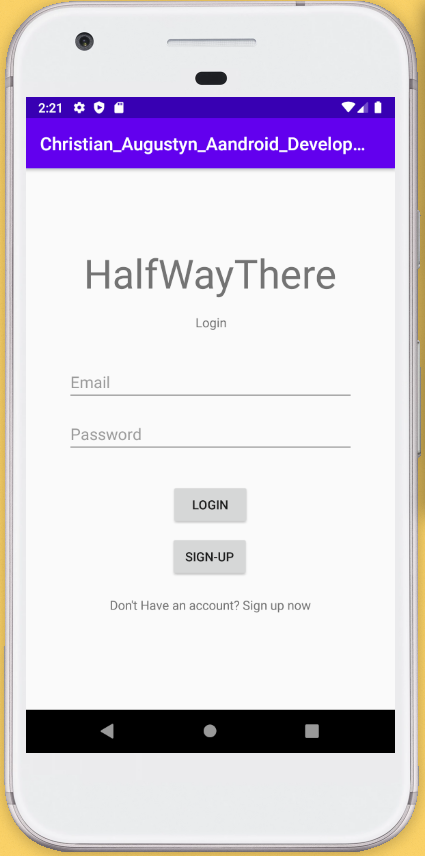
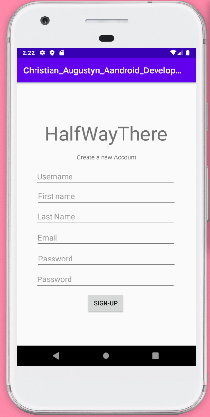
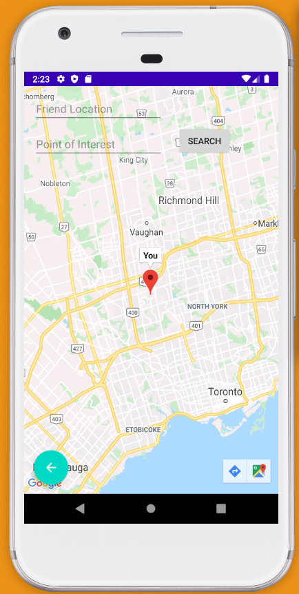
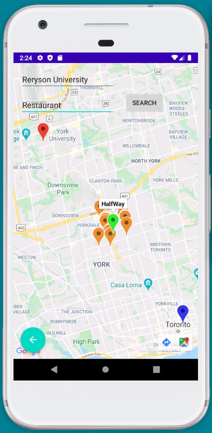

# HalfWayThere

HalfWayThere is an android application that tries to mediate the issue indidividuals have when deciding on a location to meet
. This app takes the users current position and a position of a friend and finds the exact Halfway Point between the two users it 
will then start to show all locations that resemble the Point of interest within a 1 km radius of the Halfway point.

This App uses:
<ul>
  <li>FireBase Authetication</li>
  <li>FireBase Realtime Database</li>
  <li>Google Maps SDK for Android</li>
  <li>Google Places API</li>
</ul>

 
  
